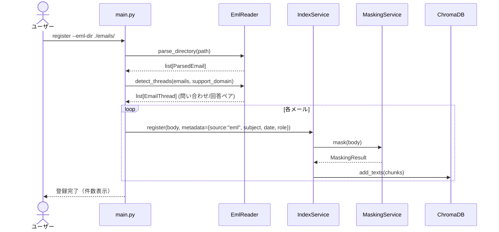

# 設計書

## アーキテクチャ概要

## コンポーネント設計

### 1. src/etl/__init__.py — パッケージ公開

### 2. src/etl/eml_reader.py — .emlパーサー + スレッド検出

**ParsedEmail** データクラス:
- subject, from_address, to_address, date, body, message_id, in_reply_to, references

**EmlReader** クラス:
- `parse_file(path) -> ParsedEmail`: 単一ファイルのパース
- `parse_directory(path) -> list[ParsedEmail]`: ディレクトリ内の全.emlをパース
- `detect_threads(emails, support_domain) -> list[EmailThread]`: スレッド構築+ペア判定

**実装の要点**:
- Python標準ライブラリ `email` でパース（追加依存なし）
- text/plain優先、なければtext/htmlをBeautifulSoupでテキスト化
- エンコーディング: charset → UTF-8/ISO-2022-JP/Shift_JIS をフォールバック
- 不正ファイルはスキップしてログ出力

### 3. src/config.py — SUPPORT_DOMAIN 追加

### 4. src/main.py — registerコマンドに --eml / --eml-dir / --support-domain を追加

## 実装の順序

1. src/etl/__init__.py + eml_reader.py（ParsedEmail + EmlReader）
2. tests/test_eml_reader.py（テスト用.emlファイルをfixtures/に配置）
3. config.py に SUPPORT_DOMAIN 追加
4. main.py の register コマンドを拡張
5. pyproject.toml に beautifulsoup4 追加
6. 品質チェック
