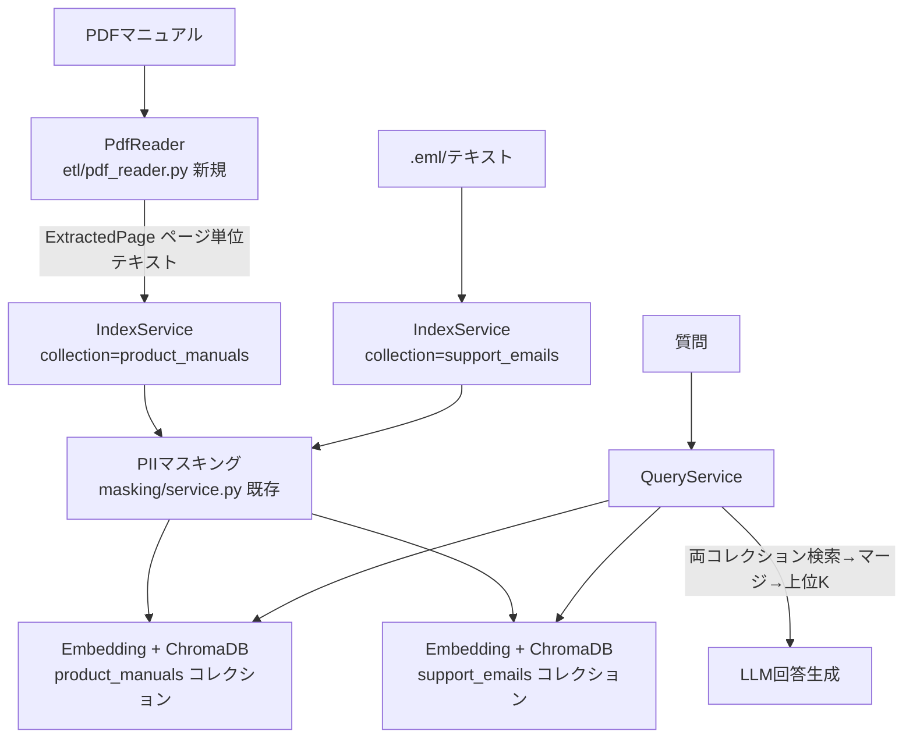

# 設計書

## アーキテクチャ概要

プロトタイプ／D-002 の RAG パイプラインに「PDFリーダー」経路を追加する。抽出→マスキング→Embedding→ChromaDB という既存フローはそのまま流用し、登録先を専用コレクション（product_manuals）に分離する。回答生成時は emails / manuals 両コレクションを検索してマージする。



## コンポーネント設計

### 1. PdfReader（etl/pdf_reader.py 新規）

**責務**:
- PyMuPDF でPDFを開き、ページ単位でテキストを抽出する（`ExtractedPage`）
- 空白ページのスキップ、ヘッダー・フッターの簡易除去
- 単一ファイル（`parse_file`）とディレクトリ一括（`parse_directory`）の両対応

**実装の要点**:
- `eml_reader.py` の構造（dataclass + Reader クラス + logger + 例外時 None/空リスト）に揃える
- `ExtractedPage(file_name, page_number, text)`
- 抽出失敗・不正PDFはログ警告して空リスト（parse_file は None）を返し、クラッシュさせない
- ヘッダー/フッター除去は行単位の正規表現（ページ番号のみの行など）で最小限に留める

### 2. IndexService（rag/index_service.py 更新）

**責務**:
- 登録先コレクションをコンストラクタ引数 `collection_name` で切り替え可能にする（デフォルトは既存互換の `COLLECTION_EMAILS`）
- PDF登録用にチャンク→ページ番号のマッピングを保持し、ページ境界をまたぐチャンクはページ範囲（"12-13"）をメタデータに記録する

**実装の要点**:
- 既存の `register(text, metadata)` シグネチャは維持（後方互換）
- 新規 `register_pages(pages: list[ExtractedPage], file_name)` を追加し、ページ結合→チャンク分割→各チャンクの由来ページを算出してメタデータ付与
- `base_metadata` の既定 source は現状 "manual" だが、呼び出し側で明示上書きするため挙動は変わらない

### 3. QueryService（rag/query_service.py 更新）

**責務**:
- emails / manuals 両コレクションを検索し、スコアでマージして上位 `SEARCH_TOP_K` 件を採用する

**実装の要点**:
- コレクションごとに `Chroma` を保持し、`similarity_search_with_score` で距離付き取得→距離昇順でマージ→上位K
- 空／未作成コレクションは結果0件として無害に扱う

### 4. main.py（更新）

**責務**:
- `register` サブコマンドに `--pdf` / `--pdf-dir` を追加
- 参照元表示で source=pdf_manual のときファイル名・ページを整形表示

## データフロー

### PDFマニュアル登録（register --pdf manual.pdf）

```
1. PdfReader.parse_file() でページ単位テキスト抽出（ExtractedPage[]）
2. IndexService(collection=product_manuals).register_pages() 呼び出し
3. ページ結合 → チャンク分割 → 各チャンクの由来ページ算出
4. PIIマスキング → Embedding → product_manuals へ add_texts（metadata: source/file_name/page/date）
```

### 回答生成（横断検索）

```
1. 質問をマスキング
2. support_emails / product_manuals をそれぞれ similarity_search_with_score
3. 全結果を距離昇順にマージし上位 SEARCH_TOP_K を採用
4. コンテキスト構築 → LLM 回答 → unmask → 参照元（メール/PDF）を返す
```

## エラーハンドリング戦略

- 不正PDF・抽出不能ページは警告ログ＋スキップ（既存 eml_reader と同じ方針）
- Ollama 接続エラーは既存 IndexService/QueryService の RuntimeError 変換を流用

## テスト戦略

### ユニットテスト（tests/test_pdf_reader.py 新規）
- テスト用PDFをフィクスチャとして生成し、ページ抽出・空白ページスキップ・不正ファイル処理を検証
- PyMuPDF でフィクスチャPDFを動的生成（テキスト埋め込み）

### 統合テスト
- 既存 tests/test_rag.py の QueryService が複数コレクション対応後も動作することを確認（回帰）

## 依存ライブラリ

- `pymupdf>=1.24`（PDFテキスト抽出）を pyproject.toml に追加

## ディレクトリ構造

```
src/
├── etl/
│   └── pdf_reader.py        # 新規
├── rag/
│   ├── index_service.py     # 更新: collection_name 引数 + register_pages
│   └── query_service.py     # 更新: 複数コレクション検索
├── main.py                  # 更新: --pdf / --pdf-dir, 参照元表示
tests/
└── test_pdf_reader.py       # 新規
```

## 実装の順序

1. pyproject.toml に pymupdf 追加・インストール
2. etl/pdf_reader.py（PdfReader, ExtractedPage）
3. rag/index_service.py（collection_name 引数 + register_pages）
4. rag/query_service.py（複数コレクション検索）
5. main.py（CLI + 参照元表示）
6. tests/test_pdf_reader.py
7. 品質チェック（pytest / ruff）
8. 振り返り・ドキュメント更新

## セキュリティ考慮事項

- PDF由来テキストも既存の PIIマスキングを必ず通してから登録する（生データを ChromaDB に残さない）
- テスト用PDFは合成データのみ使用し、実顧客マニュアルはコミットしない

## パフォーマンス考慮事項

- 大きなPDF（数百ページ）は初回登録に時間がかかる。ページ単位で逐次処理しメモリ肥大を避ける
