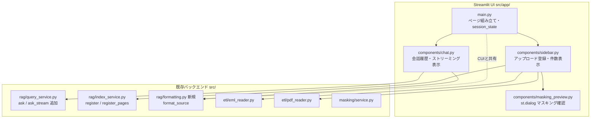

# 設計書（実装計画）

D-004 設計書（settings/04-update-web-ui.md）に基づく実装レベルの設計。ここでは実装上の判断点を補足する。

## コンポーネント構成



## 実装上の判断点

### 1. ストリーミング（ask_stream）の設計

`QueryService.ask()` を壊さず、新規 `ask_stream(question) -> StreamingAnswer` を追加する。

- 検索・質問マスキングは同期実行し、`source_documents` と `mapping` は事前に確定する
- LLM は `self._llm.stream(prompt)` でチャンクを取得
- **マスクトークンがチャンク境界で分断される**ため、逐次表示は「マスク済みチャンク」を append で見せ、生成完了後に累積マスク済み全文を一度だけ unmask して最終確定表示する（設計書 §5.2 の方針）
- `unmask` は question の mapping のみ（既存 ask と同一。context 由来のPIIは登録時にマスク済みで原文を持たないため復元不可＝正しい挙動）

`StreamingAnswer` dataclass:
```python
@dataclass
class StreamingAnswer:
    is_empty: bool                 # 検索結果0件
    guidance: str                  # is_empty時の案内文
    source_documents: list[dict]
    mapping: dict[str, str]        # unmask用（question由来）
    tokens: Iterator[str]          # マスク済みチャンクを逐次yield
```
UI側は tokens を accumulate → `masking.unmask(full, sa.mapping)` で確定表示。unmaskはUIが持つ MaskingService を使う（生成の責務はQueryService、表示整形はUI）。

### 2. format_source の共通化

`src/main.py` の `_format_source` を `src/rag/formatting.py::format_source(meta: dict) -> str` に移設。main.py は import して利用（CUI挙動は不変）。GUIの chat.py も同関数を使う。

### 3. アップロード登録のテスタビリティ

Streamlit UIコードはユニットテストしにくい。登録の中核ロジックを純粋関数に切り出す:
- `sidebar.py` 内で `st.file_uploader` → 一時ファイル保存 → Reader → IndexService 呼び出し → 一時ファイル削除、の一連を薄く保つ
- 一時ファイルは `tempfile.NamedTemporaryFile(delete=False)` で保存し、`finally` で必ず削除（PII漏洩防止）

### 4. コレクション別件数

サイドバーで emails/manuals 別の件数を表示するため、各コレクション用に `IndexService(masking, collection_name=...)` を生成し `get_stats()` を呼ぶ。count() は Ollama 接続不要。

### 5. Ollama未接続時のUX

回答生成・登録は Ollama 接続が必要。接続エラー（RuntimeError）は UI で `st.error` として捕捉表示し、アプリをクラッシュさせない。

## テスト戦略

- `tests/test_formatting.py`: format_source のメール/PDF/未知ソース分岐
- `tests/test_rag.py` に ask_stream のテスト追加（LLM.stream をモックし、逐次yield・最終unmask・空検索時 is_empty を検証）
- Streamlit UI 自体は AppTest による軽い起動テスト（Ollama非依存部分のみ）は任意。UIロジックは薄く保ち、バックエンド関数のテストでカバーする

## 依存ライブラリ

- `streamlit>=1.38`

## 実装順序

1. streamlit 追加・インストール
2. rag/formatting.py 作成 + main.py 移設（回帰確認）
3. query_service.py に ask_stream + StreamingAnswer
4. app/ 一式（main, sidebar, chat, masking_preview）
5. テスト（formatting, ask_stream）
6. 品質チェック（pytest / ruff）+ 起動スモーク
7. ドキュメント更新・振り返り

## セキュリティ考慮事項

- アップロードPDF/.emlはPIIを含む。一時ファイルは登録後に確実に削除
- 登録・回答生成ともマスキングを必ず経由（既存経路を再利用するため自動的に担保）
