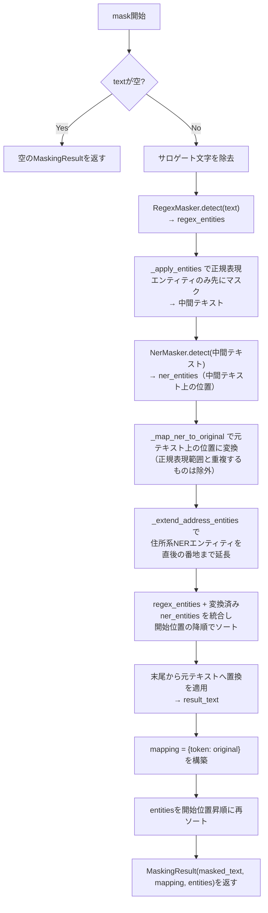

最終更新: 2026-07-15 / 対象: D-001〜D-004 実装時点 / 対象コード: src/masking/

[← README.md](README.md)

# 01. PIIマスキング（src/masking/）

正規表現による定型PII検出とGiNZA NERによる固有表現検出を組み合わせた2層マスキング機構を提供する。テキスト中のPIIをマスクトークンに置換し、LLM呼び出し後にトークンを元の値へ復元する。

## 1. データモデル（models.py）

### Entity

検出されたPII1件を表す。

| フィールド | 型 | 意味 |
|---|---|---|
| `original` | `str` | 検出された元の文字列 |
| `label` | `str` | PII種別ラベル（`EMAIL`/`PHONE`/`ZIPCODE`、またはGiNZAのエンティティラベル `Person`/`Province`/`City`/`Country`/`Postal_Address`） |
| `token` | `str` | 置換先のマスクトークン。`[{label}_{連番}]` 形式（例: `[EMAIL_1]`、架空の例） |
| `start` | `int` | 元テキスト上の開始位置（文字インデックス） |
| `end` | `int` | 元テキスト上の終了位置 |
| `source` | `str` | 検出元。`"regex"` または `"ner"` |

### MaskingResult

`MaskingService.mask()` の戻り値。

| フィールド | 型 | 意味 |
|---|---|---|
| `masked_text` | `str` | マスキング後のテキスト |
| `mapping` | `dict[str, str]` | トークン→元の値の対応表（デフォルト空dict） |
| `entities` | `list[Entity]` | 検出された全エンティティ（開始位置昇順、デフォルト空リスト） |

## 2. RegexMasker（regex_masker.py）

正規表現で定型PIIを検出する第1層。

### 検出パターン一覧

| PII種別 | 正規表現の概要 | マスクトークン形式 |
|---|---|---|
| `EMAIL` | `[\w.\-+]+@[\w\-]+\.[\w.\-]+` | `[EMAIL_1]`, `[EMAIL_2]`, ... |
| `ZIPCODE` | `\d{3}-\d{4}`（前後に数字が続かないことを否定先読み/後読みで確認） | `[ZIPCODE_1]`, ... |
| `PHONE` | `0\d{1,4}[-\s]\d{1,4}[-\s]\d{3,4}`（ハイフンまたはスペース区切り必須） | `[PHONE_1]`, ... |
| `ADDRESS` | 都道府県名（47件を列挙）＋20文字以内＋市区町村郡＋15文字以内＋番地（`ADDRESS_NUMBER`） | `[ADDRESS_1]`, ... |

- `PHONE` は区切り文字なし（例: `0312345678`）を対象外とする。区切りなし表記は郵便番号との誤検出を避けるため
- `ZIPCODE` は前後に数字がないことを否定先読み/後読みで確認し、電話番号の一部（`03-1234-5678` の `234-5678`）を誤検出しないようにする
- `ADDRESS` は GiNZA が地名として検出しない住所（例: `大阪府大阪市北区梅田2-4-9`）を補うため 2026-09-15 に追加した。誤検出を抑えるため、都道府県名・市区町村・番地の3つが揃った場合だけ検出する（建物名・部屋番号は対象外）
- `ADDRESS_NUMBER`（番地）: `1丁目1番1号`・`北1条西2丁目` のような単位付き（丁目/番地/番/号/条）、または `1-1-1`・`７２１−１` のようなハイフン区切り。数字は半角・全角・漢数字（一〜十）に対応する。**直前が助詞（で/に/は/を/が/と/も）の場合は番地とみなさない**（`大阪府で3-4名` の `3-4` を住所にしないため）
- `ADDRESS_CONTINUATION`: 「町名（数字・区切り文字を含まない12文字以内）＋番地」のパターン。`MaskingService._extend_address_entities()` が、NERで検出した地名の直後に続く番地の検出に使う

### detect(text) -> list[Entity]

- 責務: テキストから定型PIIを検出し `Entity` のリストを返す
- 入力: マスキング対象の生テキスト
- 出力: 開始位置昇順にソートされた `Entity` のリスト
- 処理の要点:
  - `PRIORITY = ["EMAIL", "ZIPCODE", "PHONE", "ADDRESS"]` の順でパターンを走査し、先に検出した範囲を `occupied` に記録する（`ADDRESS` は番地に数字を含むため最後にし、郵便番号・電話番号を優先する）
  - 後続パターンが既存の占有範囲と重なるマッチはスキップし、パターン間の重複検出を防ぐ
  - PII種別ごとに1始まりの連番カウンタでトークンを採番する（`counters` はラベルごとに独立）

## 3. NerMasker（ner_masker.py）

GiNZA（spaCy日本語モデル `ja_ginza`）による固有表現認識を行う第2層。

- モデルロード: コンストラクタで `spacy.load("ja_ginza", config=...)` を試行する。このロードは重い処理のため、`MaskingService`（＝内部で `NerMasker` を生成）のインスタンス化コストは高い。CLIはコマンド実行ごとに新規生成し、WebUIは `@st.cache_resource` で使い回す（[04-cli.md](04-cli.md)・[05-webui.md](05-webui.md) 参照）。`compound_splitter.split_mode` を明示的に `"A"` に設定しているのは、ginza 5.2 + spaCy 3.8.x の組み合わせで `split_mode=None`（デフォルト）がバリデーションエラーになる既知の問題を回避するため
- **モデル未ロード時のフォールバック**: ロードに失敗した場合（環境にGiNZAが存在しない等）は `self._nlp = None` のまま警告ログを出力し、`detect()` は常に空リストを返す。この場合、マスキングは正規表現層のみで行われる（クラッシュしない）
- 検出対象エンティティラベル（`TARGET_LABELS`）: `Person`, `Province`, `City`, `Country`, `Postal_Address`。GiNZAは地名を `Location` ではなく `Province`/`City`/`Country` 等で返すため、これらを個別に列挙している
  - `Postal_Address`: 郵便番号の近くにある住所（例: `〒100-0001 東京都千代田区1-1-1`）を GiNZA は `City` ではなく `Postal_Address` として返す。対象外だと住所がマスクされないまま残るため追加した（2026-09-15）
  - 正規表現でマスク済みの `〒[ZIPCODE_1]` 自体も `Postal_Address` として検出されるが、元テキストに存在しない文字列のため `_map_ner_to_original` で対応付かず除外される（二重マスクは発生しない）

### detect(text) -> list[Entity]

- 責務: テキストからGiNZAの固有表現認識結果のうち `TARGET_LABELS` に含まれるものを抽出する
- 入力: マスキング対象テキスト（後述の通り、`MaskingService` からは正規表現マスク済みのテキストが渡される）
- 出力: `Entity` のリスト（ラベルごとに1始まりの連番でトークン採番、`source="ner"`）
- 処理の要点:
  - `self._nlp is None` の場合は即座に空リストを返す
  - `doc.ents` を走査し、`TARGET_LABELS` に含まれないラベル（`Organization` 等）は無視する

## 4. MaskingService（service.py）

正規表現層とNER層を統合し、テキストのマスキング／アンマスキングを提供する。

### mask(text) -> MaskingResult

- 責務: テキスト中のPIIを検出し、マスクトークンに置換した結果を返す
- 入力: マスキング対象の生テキスト
- 出力: `MaskingResult`（`masked_text`, `mapping`, `entities`）
- 処理の要点:
  1. 空文字列は即座に空の `MaskingResult` を返す
  2. Docker tty経由の日本語入力でサロゲート文字が混入する場合があるため、`encode("utf-8", errors="surrogateescape").decode("utf-8", errors="replace")` で除去する
  3. 第1層（`RegexMasker.detect`）で定型PIIを検出し、`_apply_entities()` でその範囲だけを先にマスクした中間テキストを作る
  4. 第2層（`NerMasker.detect`）は正規表現マスク済みの中間テキスト上で実行する。これにより、既にマスクされたメールアドレス等をNERが二重検出することを防ぐ
  5. NERの検出位置は中間テキスト上の位置なので、`_map_ner_to_original()` で元テキスト上の位置に変換する
  6. `_extend_address_entities()` で、住所系ラベル（`ADDRESS_LABELS`）のNERエンティティの範囲を直後の番地まで延ばす（GiNZAは `千代田区1-1-1` のうち `千代田区` だけを地名として返すため）
  7. 正規表現エンティティとNERエンティティ（元テキスト位置に変換済み）を合算し、開始位置の**降順**にソートしてから元テキストへ置換を適用する。末尾から置換することで、前方の置換によって後方の位置情報がずれる問題を回避する
  8. `mapping` はトークン→元の値の辞書として構築し、最終的に `entities` は開始位置昇順に再ソートして返す

### unmask(text, mapping) -> str

- 責務: マスクトークンを元のPII値に復元する
- 入力: マスクトークンを含むテキスト、`mapping`（トークン→元の値）
- 出力: 復元後のテキスト
- 処理の要点: `mapping` の各トークンについて単純な文字列置換（`str.replace`）を順に適用する。`[LABEL_N]` 形式のトークン文字列が原文（およびLLM回答の非トークン部分）に偶然出現しないことを前提とした実装である

### _apply_entities(text, entities) -> str（プライベート）

- 責務: 指定エンティティ群の範囲だけをマスクトークンに置換した中間テキストを作る
- 処理の要点: エンティティを開始位置降順でソートしてから置換する（前方の置換が後方の位置をずらさないようにするため。`mask()` 本体の最終置換と同じ手法）

### _map_ner_to_original(original_text, regex_entities, ner_entities) -> list[Entity]（プライベート）

- 責務: 正規表現マスク済み中間テキスト上で検出されたNERエンティティの位置を、元テキスト上の位置に再特定する
- 処理の要点:
  - 占有範囲集合 `occupied` を `regex_entities` の `(start, end)` で初期化し、重複除外に使う
  - 各NERエンティティの元文字列（`ner_ent.original`）を `original_text.find()` で走査的に検索し、占有範囲と重ならない最初の出現位置を採用する。採用した範囲は `occupied` に追加する（これにより**同一の固有表現が複数回出現しても各エンティティが別々の出現位置に対応付く**。2026-07-15 に、全出現が最初の位置へ重複マッピングされ2回目以降がマスク漏れするバグを修正済み。回帰テスト: `tests/test_masking.py` の `test_mask_duplicate_ner_entity`）
  - 見つからない場合はそのNERエンティティを結果から除外する（元テキストに存在しない＝正規表現マスクによって文字列が変化した箇所とみなす）

### _extend_address_entities(original_text, regex_entities, ner_entities) -> list[Entity]（プライベート）

- 責務: 住所系ラベル（`ner_masker.ADDRESS_LABELS` = `Province`/`City`/`Postal_Address`）のNERエンティティについて、直後に続く町名・番地を範囲に含める
- 処理の要点:
  - 各エンティティの終了位置から `regex_masker.ADDRESS_CONTINUATION` を `match()` し、一致すればその終了位置まで `end` と `original` を延ばした新しい `Entity` に置き換える（トークンは変えない）
  - 延長後の範囲が他のエンティティ（正規表現・NER）と重なる場合は延長しない。重なったまま置換するとトークンが破損するため
  - 例: `千代田区1-1-1にお越しください` → `[City_1]にお越しください`（`mapping` は `千代田区1-1-1`）。`港区に2-3社あります` は助詞 `に` を挟むため延長しない
- 回帰テスト: `tests/test_masking.py` の `TestAddressMasking`（2026-09-15 追加）

## 参照

- 呼び出し元: [02-rag.md](02-rag.md) の `IndexService`（登録前のマスキング）・`QueryService`（質問文のマスキングと回答のアンマスキング）
- 呼び出し元: [04-cli.md](04-cli.md) の `cmd_mask`/`cmd_register`
- 呼び出し元: [05-webui.md](05-webui.md) の `sidebar.py`（登録前プレビュー）・`chat.py`（回答アンマスク）
