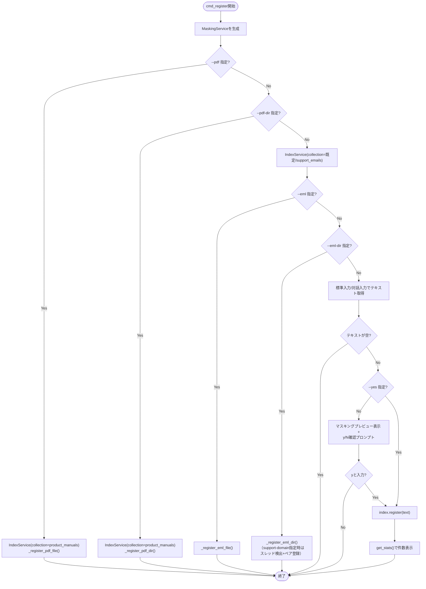

最終更新: 2026-07-15 / 対象: D-001〜D-004 実装時点 / 対象コード: src/main.py・src/config.py

[← README.md](README.md)

# 04. CLI（src/main.py・src/config.py）

`python -m src.main` で起動するコマンドラインインターフェース。`mask`/`register`/`ask`/`chat` の4サブコマンドを提供する。設定値は `config.py` に一元管理する。

## 1. 設定管理（config.py）

`PROJECT_ROOT`（`config.py` の2階層上、リポジトリルート）を基準にパスを解決する。

| 定数名 | 環境変数名 | デフォルト値 | 用途 | 参照元モジュール |
|---|---|---|---|---|
| `OLLAMA_BASE_URL` | `OLLAMA_BASE_URL` | `http://localhost:11434` | OllamaのHTTPエンドポイント | `rag/index_service.py`, `rag/query_service.py` |
| `LLM_BACKEND` | `LLM_BACKEND` | `local` | LLMバックエンド切替用フラグ（D-006で本格利用予定。現状は値を保持するのみで参照箇所なし） | なし（未使用） |
| `MODEL_NAME` | `MODEL_NAME` | `gemma4:12b` | 回答生成に使うOllamaモデル名 | `rag/query_service.py` |
| `EMBEDDING_MODEL` | `EMBEDDING_MODEL` | `nomic-embed-text` | Embedding生成に使うOllamaモデル名 | `rag/index_service.py`, `rag/query_service.py` |
| `COLLECTION_NAME` | - | `"support_emails"` | `IndexService` の `collection_name` 省略時の既定コレクション | `rag/index_service.py` |
| `COLLECTION_EMAILS` | - | `"support_emails"` | メール履歴コレクション名 | `rag/query_service.py`, `app/components/sidebar.py` |
| `COLLECTION_MANUALS` | - | `"product_manuals"` | PDFマニュアルコレクション名 | `main.py`, `rag/query_service.py`, `app/components/sidebar.py` |
| `PERSIST_DIR` | - | `<PROJECT_ROOT>/data/chroma_db` | ChromaDB永続化ディレクトリ | `rag/index_service.py`, `rag/query_service.py` |
| `CHUNK_SIZE` | - | `512` | チャンク分割の最大文字数 | `rag/index_service.py` |
| `CHUNK_OVERLAP` | - | `50` | チャンク分割のオーバーラップ文字数 | `rag/index_service.py` |
| `SEARCH_TOP_K` | - | `5` | 類似検索で取得する件数（コレクションごと、かつマージ後の上限） | `rag/query_service.py` |
| `SUPPORT_DOMAIN` | `SUPPORT_DOMAIN` | `""`（未設定） | `.eml`スレッドの問い合わせ/回答ペア判定用ドメイン | `main.py`（`_register_eml_dir` の既定値） |
| `TEMPERATURE` | - | `0.3` | LLM生成温度 | `rag/query_service.py` |
| `MAX_TOKENS` | - | `1024` | LLM生成の最大トークン数（`ChatOllama` の `num_predict`） | `rag/query_service.py` |
| `SYSTEM_PROMPT` | - | （固定の日本語プロンプト文字列。`{context}` プレースホルダを含む） | 回答生成プロンプトの雛形 | `rag/query_service.py` |

`LLM_BACKEND` は環境変数として読み込まれるのみで、現行コードのいずれのモジュールからも分岐条件として参照されていない（D-006 LLMバックエンド切替の未実装部分に相当する設定の先行定義）。

## 2. コマンド体系

`argparse` の `subparsers`（`dest="command", required=True`）で4コマンドを定義する。

| コマンド | 概要 | オプション |
|---|---|---|
| `mask` | PIIマスキングのみ実行し、マスキング結果と検出PII一覧を表示 | `text`（位置引数、`nargs="*"`。省略時は標準入力またはインタラクティブ入力） |
| `register` | テキスト/`.eml`/PDFをRAGに登録 | `--yes`/`-y`（確認スキップ）, `--eml`（単一ファイル）, `--eml-dir`（ディレクトリ）, `--support-domain`（ペア判定用ドメイン）, `--pdf`（単一ファイル）, `--pdf-dir`（ディレクトリ） |
| `ask` | 質問1件に対する回答を生成 | `question`（位置引数、`nargs="+"`、必須） |
| `chat` | 対話モード（`input()` ループ） | なし |

`main()` はコマンド名から対応する `cmd_*` 関数への辞書ディスパッチ（`commands = {"mask": cmd_mask, ...}`）で実行する。サブコマンド省略時は `required=True` により argparse が使用方法のエラーを表示して終了する（終了コード2）。

### 標準入力ユーティリティ: _read_multiline(prompt)

- 責務: Docker tty環境では `sys.stdin.read()` のCtrl+Dが効かないため、`input()` ループで1行ずつ読み取る
- 処理の要点: 1行以上入力後に空行のみのEnterで入力完了とする。`EOFError`/`KeyboardInterrupt` は握りつぶして、それまでの入力内容を返す

## 3. 各コマンドの処理フロー

### cmd_mask(args)

- `args.text` があればそれを結合、なければ非TTY標準入力を読む、それも無ければ `_read_multiline()` で対話入力を受ける
- `MaskingService().mask(text)` を呼び出し、`masked_text` と検出エンティティ一覧（`token → original (label, source)`）を標準出力に表示する

### cmd_register(args)

.eml・PDF・テキスト直接入力の3系統、かつそれぞれ単一ファイル/ディレクトリの分岐を持つ。Ollama接続が必要な `rag`/`etl` のインポートは関数内で遅延させ、`mask` コマンド単体では接続不要にしている。

補足:
- `--pdf`/`--pdf-dir`/`--eml`/`--eml-dir` は排他チェックされず**優先順位で判定される**（`--pdf` > `--pdf-dir` > `--eml` > `--eml-dir` > テキスト直接入力）。複数同時指定時は優先度の高い1系統のみが処理され、他は無視される
- PDF系（`--pdf`/`--pdf-dir`）は必ず `IndexService(collection_name=config.COLLECTION_MANUALS)` を使い、テキスト・`.eml`系は既定コレクション（`support_emails`）を使う
- `_register_eml_dir` は `support_domain`（`--support-domain` またはフォールバックの `config.SUPPORT_DOMAIN`）が設定されている場合のみ `EmlReader.detect_threads()` でスレッド検出・ペア登録（`role: "inquiry"/"response"` メタデータ付与）を行う。未設定時は全メールを個別登録する
- `_register_pdf_dir` はページをファイル名ごとにグルーピングしてから `register_pages()` を呼ぶ（1PDFにつき1回の登録呼び出し）

### cmd_registerの登録経路別ヘルパー（プライベート）

各ヘルパーは登録完了後に `index.get_stats()` を呼び、登録済み件数を表示する点で共通する（ただし表示ラベルはテキスト・`.eml`系が「登録済みドキュメント数」、PDF系が「登録済みマニュアルチャンク数」と異なる）。

**_register_eml_file(args, index)**

- 責務: 単一 `.eml` ファイルを登録する
- 処理の要点: `EmlReader().parse_file()` でパースし、失敗時（`None`）はエラーメッセージを表示して終了する。メタデータは `{"source": "eml", "subject": parsed.subject}`（`date` があれば追加）。`index.register(parsed.body, metadata=...)` を呼ぶ

**_register_eml_dir(args, index)**

- 責務: ディレクトリ内の全 `.eml` を登録する。スレッド検出の有無で経路が分岐する
- 処理の要点:
  - `EmlReader().parse_directory()` で全件パース。0件ならエラーメッセージを表示して終了
  - `support_domain` 設定時: `detect_threads()` の結果をスレッドごとに処理し、`thread.pairs` があれば各ペアを `role: "inquiry"`/`"response"` として個別登録、ペアが無いスレッドは各メールを個別登録する。いずれもメタデータに `thread_id`（ペアがある場合のみ）・`subject`・（あれば）`date` を付与する
  - `support_domain` 未設定時: 全メールを `{"source": "eml", "subject": ..., "date": ...}` で個別登録する（スレッド構造は無視される）
  - 登録チャンク数を `total_chunks` に積算し、最後に件数サマリを表示する

**_register_pdf_file(args, index)**

- 責務: 単一PDFファイルを登録する
- 処理の要点: `PdfReader().parse_file()` でページ抽出。抽出0件ならエラーメッセージを表示して終了。`index.register_pages(pages, file_name=path.name)` を呼ぶ

**_register_pdf_dir(args, index)**

- 責務: ディレクトリ内の全PDFを登録する
- 処理の要点: `PdfReader().parse_directory()` で全PDFの全ページを平坦なリストとして取得後、`page.file_name` でファイルごとに再グルーピング（`pages_by_file`）してから、ファイルごとに1回 `register_pages()` を呼ぶ。ファイルごとのチャンク数を都度表示し、最後に合計を表示する

### cmd_ask(args) / cmd_chat(args)

- 箇条書きで表現できる程度の単純なフローのためMermaid図は省略する
- `cmd_ask`: `QueryService.ask(question)` を1回呼び出し、`result.answer` と `format_source()` で整形した `source_documents` を表示して終了する
- `cmd_chat`: `input()` ループで質問を受け付け、`quit`/`exit`/`q`（大小文字無視）で終了する。各質問ごとに `QueryService.ask()` を呼び出し、`cmd_ask` と同様に回答・参照元を表示する。会話履歴はプロセス内で保持しない（`QueryService` 自体もステートレス。前の質問はプロンプトに引き継がれない）
- いずれも `masking = MaskingService()` を関数内で新規生成する（`app/main.py` の `@st.cache_resource` のようなキャッシュは行わない）

## 参照

- `MaskingService`: [01-masking.md](01-masking.md)
- `IndexService`/`QueryService`/`format_source`: [02-rag.md](02-rag.md)
- `EmlReader`/`PdfReader`: [03-etl.md](03-etl.md)
- WebUI側の同等機能: [05-webui.md](05-webui.md)
- テスト: `main.py`（`cmd_*` 各関数）・`config.py` を直接対象とした自動テストは現時点で存在しない（[README.md](README.md) 4章参照）。CLI変更時は手動確認が必要
