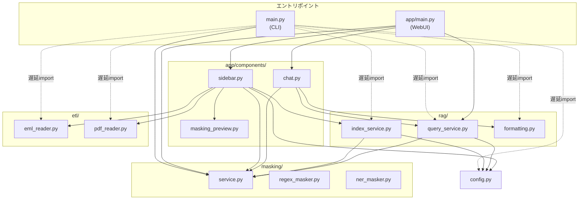
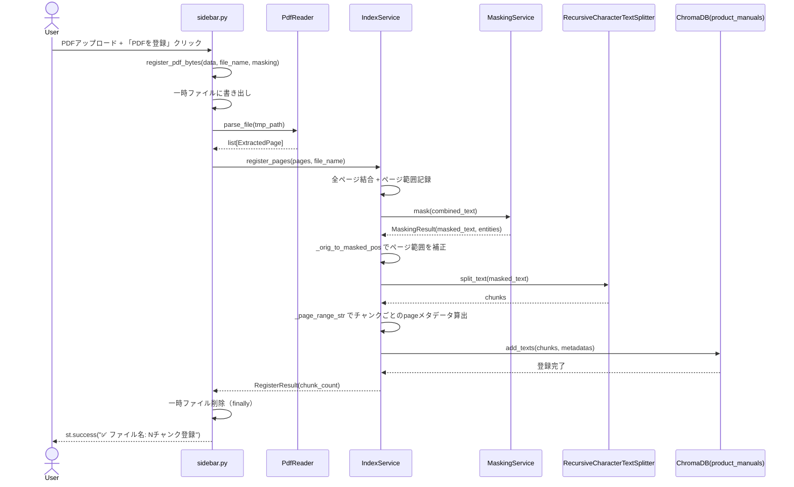
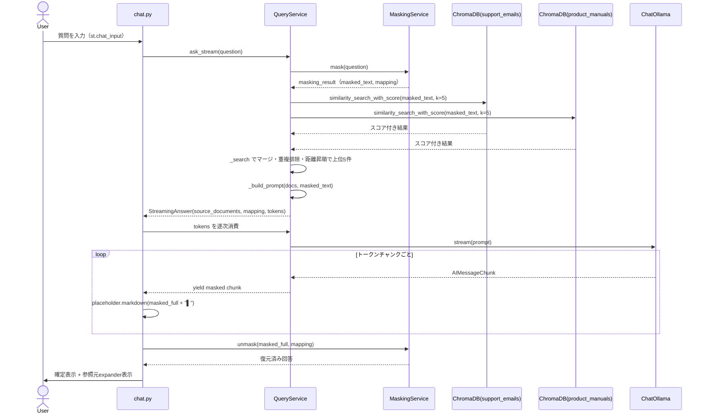

最終更新: 2026-07-15 / 対象: D-001〜D-004 実装時点 / 対象コード: src/

# 詳細設計書（現行実装スナップショット）

## 1. 本書の位置づけ

D-001（プロトタイプ）〜D-004（WebUI）で実装済みの現行コード（`src/` 配下）を対象に、「現在どう動くか」をモジュール単位で説明する。

- 対象外: [D-005（Zendesk連携）](../phases/05-update-zendesk.md)・[D-006（LLMバックエンド切替）](../phases/06-update-llm-switch.md)。いずれも未実装。ただし `config.py` の `LLM_BACKEND` 環境変数のように、切替のための設定値が既に存在する箇所は「実装済みの範囲」として本書に記載する
- 各フェーズの導入経緯・意思決定は [phases/01-prototype.md](../phases/01-prototype.md)〜[phases/04-update-web-ui.md](../phases/04-update-web-ui.md)、要求の背景は [product-requirements.md](../product-requirements.md) を参照。本書はそれらの要約ではなく、実装コードを読み取って書き起こしたものである
- 用語は [glossary.md](../glossary.md) に準拠する。なお本書で「回答」「回答生成」と表記するものは、用語集の「回答ドラフト」（人間が確認・編集する前のAI生成下書き）を指す。本システムが回答を自動送信することはない
- **更新ルール**: 本書は実装スナップショットのため、`src/` 配下のモジュール構成・公開シンボル・主要な処理フローに変更があった場合は、該当モジュールのファイルと本README（構成図・パッケージ一覧・シーケンス図・テスト構成表）を合わせて更新し、冒頭の「最終更新」日付を改める

### ファイル一覧

| ファイル | 概要 |
|---|---|
| [01-masking.md](01-masking.md) | PIIマスキング（`src/masking/`）。正規表現＋GiNZA NERの2層検出、マスク/アンマスク |
| [02-rag.md](02-rag.md) | RAGパイプライン（`src/rag/`）。登録（チャンク分割・Embedding）、検索、回答生成 |
| [03-etl.md](03-etl.md) | データ取り込み（`src/etl/`）。.emlパース・スレッド検出、PDFページ抽出 |
| [04-cli.md](04-cli.md) | CLI（`src/main.py`）と設定管理（`src/config.py`） |
| [05-webui.md](05-webui.md) | WebUI（`src/app/`）。Streamlitによるチャット画面・データ登録画面 |

## 2. 全体構成

### 2.1 モジュール構成図

CLI（`main.py`）とWebUI（`app/`）が2つのエントリポイントであり、いずれも RAGパイプライン（`rag/`）を介して マスキング（`masking/`）とVector DB（ChromaDB）を利用する。データ取り込み（`etl/`）は登録経路から直接呼び出される独立モジュールで、`masking/`・`rag/` に依存しない。



main.py がモジュール冒頭でインポートするのは `MaskingService` のみで、Ollama 接続を要する `rag`/`etl` に加え `config`・`formatting` のインポートも各コマンド関数内に遅延させ、`mask` コマンド単体では接続不要にしている（詳細は [04-cli.md](04-cli.md)）。

### 2.2 パッケージ一覧

| パッケージ | 責務 | 主要公開シンボル | 依存先 | 詳細 |
|---|---|---|---|---|
| `src.masking` | PIIの検出・マスキング・アンマスキング | `MaskingService`, `RegexMasker`, `NerMasker`, `Entity`, `MaskingResult` | なし（GiNZA/spaCyは外部ライブラリ） | [01-masking.md](01-masking.md) |
| `src.rag` | チャンク分割・Embedding登録・類似検索・回答生成 | `IndexService`, `QueryService`, `RegisterResult`, `AnswerResult`, `StreamingAnswer`, `format_source` | `src.masking`, `src.config`, `src.etl`（`ExtractedPage` 型参照） | [02-rag.md](02-rag.md) |
| `src.etl` | .eml/PDFからのテキスト抽出 | `EmlReader`, `PdfReader`, `ParsedEmail`, `EmailThread`, `ExtractedPage` | なし | [03-etl.md](03-etl.md) |
| `src.main` / `src.config` | CLIエントリポイント・設定値の一元管理 | `main()`, `cmd_mask`/`cmd_register`/`cmd_ask`/`cmd_chat`, 各種定数 | `src.masking`, `src.rag`, `src.etl` | [04-cli.md](04-cli.md) |
| `src.app` | Streamlit WebUIエントリポイントと画面部品 | `main()`, `render_sidebar`, `render_chat`, `render_masking_result` | `src.masking`, `src.rag`, `src.etl`, `src.config` | [05-webui.md](05-webui.md) |

注: 「主要公開シンボル」は各パッケージが提供する主なクラス・関数の一覧であり、パッケージ直下（`__init__.py` の `__all__`）から import できるのはその一部のみ（`src.masking` は `MaskingService`、`src.rag` は `IndexService`/`QueryService`、`src.etl` は `EmlReader` のみ）。実際の呼び出し元コードはいずれも `from src.rag.index_service import IndexService` のように**サブモジュールを直接 import** しており、データモデルや `PdfReader`・`format_source` もサブモジュール（`models.py`・`pdf_reader.py`・`formatting.py`）から import する。

### 2.3 実行形態

**CLI（`python -m src.main`）**

```bash
python -m src.main mask "テキスト"           # マスキングのみ
python -m src.main register                 # テキスト/eml/PDFをRAGに登録
python -m src.main ask "質問"                # 単発の回答生成
python -m src.main chat                      # 対話モード
```

**WebUI（`streamlit run src/app/main.py`）**

Streamlit のチャットUI。サイドバーでデータ登録（.eml/PDF/テキスト）、メインエリアでチャット形式の回答生成を行う。ブラウザタブのタイトル（`page_title`）は「CS Draft Generator」、画面見出し（`st.title`）は「💬 CS回答ドラフト生成」。

**Docker構成**

`Dockerfile` はデフォルト `CMD` で WebUI（`streamlit run src/app/main.py --server.address=0.0.0.0 --server.port=8501 --server.headless=true`）を起動する。`compose.yaml` は `127.0.0.1:8501:8501` にのみバインドし（PIIを扱うためLAN非公開）、`./data:/app/data` を chroma_db 永続化とCLI登録用ファイル受け渡しの両方に使う。環境変数は `.env` に加え `compose.yaml` の `environment` で `OLLAMA_BASE_URL=http://host.rancher-desktop.internal:11434`（Rancher Desktop からホスト上の Ollama への接続先）を設定する。CUIコマンドは `docker compose exec app python -m src.main ...` で利用する。ベースイメージは `python:3.11-slim`。

## 3. 主要ユースケースのシーケンス図

### 3.1 データ登録（WebUIでPDFをアップロードした場合）

サイドバー（[05-webui.md](05-webui.md)）の `register_pdf_bytes` を起点に、PDF抽出→マスキング→チャンク分割→ChromaDB登録が行われる。



### 3.2 回答生成（WebUIチャット）



### 3.3 回答生成（CLI `ask`/`chat` の場合の差分）

CLIは `QueryService.ask()`（非ストリーミング）を使う点がWebUIと異なる。検索・プロンプト構築・LLM呼び出し（`ChatOllama.invoke`）・アンマスクまでを `ask()` 内部で同期的に完結させ、`main.py` は完成済みの `AnswerResult.answer` と `source_documents` を `format_source()` で整形して表示するだけである。`st.session_state` に相当する状態保持は行わず、`chat` サブコマンドは `input()` ループで対話を継続する（詳細は [04-cli.md](04-cli.md)）。

## 4. テスト構成

| テストファイル | 対象モジュール | 概要 |
|---|---|---|
| `tests/test_masking.py` | `masking/regex_masker.py`, `masking/service.py` | メール/電話/郵便番号/住所の正規表現検出、`MaskingService.mask()`/`unmask()` の統合動作、NER地名の番地までの延長（`TestAddressMasking`。GiNZA非依存のスタブで検証） |
| `tests/test_ner_masker.py` | `masking/ner_masker.py` | GiNZAによる人名・地名・郵便番号付き住所（`Postal_Address`）の検出。GiNZA未ロード環境（`_nlp is None`）では `pytest.mark.skipif` で全テストをスキップする |
| `tests/test_rag.py` | `rag/index_service.py`, `rag/query_service.py` | `OllamaEmbeddings`/`ChatOllama`/`config` を `unittest.mock.patch` でモックし、外部接続なしで `RegisterResult`/`AnswerResult`/`StreamingAnswer` の生成を検証する統合テスト |
| `tests/test_eml_reader.py` | `etl/eml_reader.py` | `tests/fixtures/*.eml`（inquiry/response/standalone）を用いた本文抽出・ヘッダー抽出の検証 |
| `tests/test_pdf_reader.py` | `etl/pdf_reader.py`, `rag/index_service.py`（ページ範囲算出の純粋関数） | PyMuPDFでテスト用PDFを動的生成し、ページ単位抽出と `_orig_to_masked_pos`/`_page_range_str` を検証 |
| `tests/test_formatting.py` | `rag/formatting.py` | `format_source()` の表示整形ルール（PDF/メール/未知ソース） |

`tests/fixtures/` に `.eml` サンプル3件（`inquiry.eml`, `response.eml`, `standalone.eml`）を格納。PDFフィクスチャは固定ファイルを持たず、各テスト内でPyMuPDFにより動的生成する。`src/app/` 配下（WebUI部品）を対象とした自動テストは現時点で存在しない。
