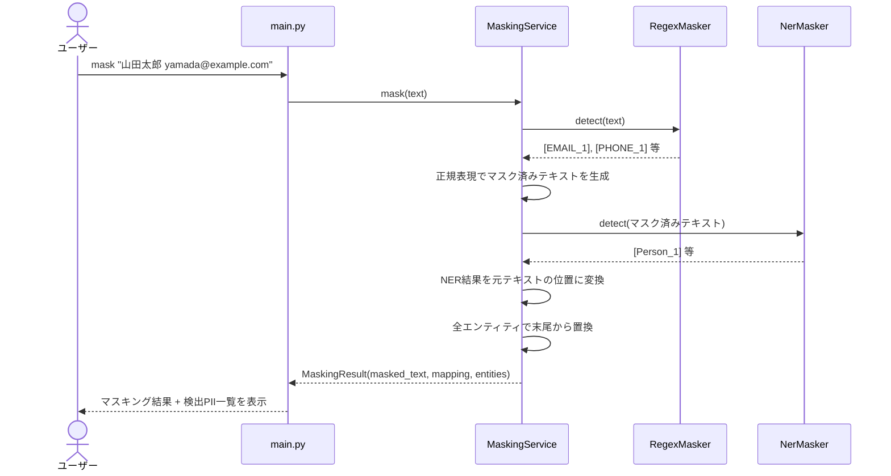
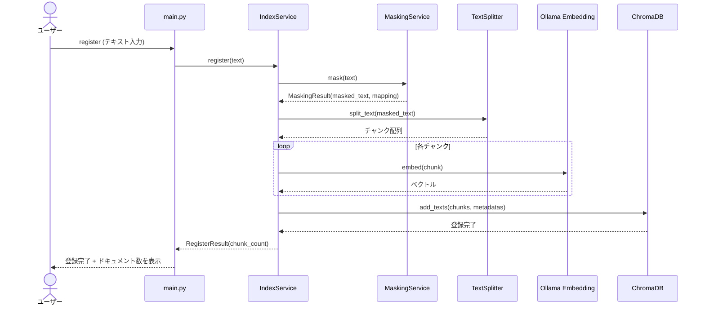
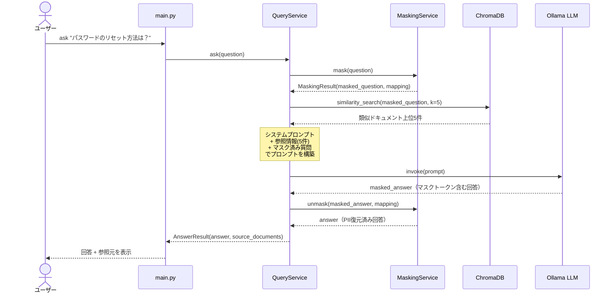

# D-001: プロトタイプ設計書

| 項目 | 値 |
|---|---|
| フェーズ | プロトタイプ |
| ステータス | 作成中 |
| 作成日 | 2026-06-17 |
| 前提 | [アーキテクチャ設計書](../architecture.md)、[プロダクト要求定義書](../product-requirements.md) |

## 1. ゴール

テキスト入力 → PIIマスキング → RAG登録 → CUIベースでローカルLLMが回答生成、という一連の流れを最小構成で動作確認する。

### スコープ内

- テキスト直接入力（コマンドライン引数またはプロンプト入力）
- PII自動マスキング（正規表現 + GiNZA NER）
- マスキング済みテキストのEmbedding生成 + ChromaDB登録
- 登録済みデータを参照したRAG回答生成（Ollama + Gemma 4 12B）
- CUI対話インターフェース

### スコープ外

- ファイル読み込み（.eml等） → 第1弾
- GUI / Webアプリ → 第2弾
- 外部API連携（Zendesk等） → 第3弾
- クラウドLLM切替 → プロトタイプ検証後
- 製品マニュアル取り込み → プロトタイプ検証後

## 2. アーキテクチャ

### 2.1 全体構成

```
┌─ Docker コンテナ ──────────────────────────────────────┐
│                                                        │
│  ┌──────────────────────────────────────────────────┐  │
│  │ CLI エントリポイント (main.py)                      │  │
│  │  main mask   … マスキング単独実行                   │  │
│  │  main register … マスキング → RAG登録              │  │
│  │  main ask/chat … マスキング → RAG検索 → 回答生成   │  │
│  └──────┬────────────────────────┬───────────────────┘  │
│         │                        │                     │
│         ▼                        ▼                     │
│  ┌──────────────┐    ┌───────────────────────────┐     │
│  │ MaskingService│    │ RAG Service               │     │
│  │              │    │  ┌───────────────────────┐│     │
│  │ mask()       │    │  │ IndexService          ││     │
│  │ unmask()     │    │  │  register()           ││     │
│  │              │    │  ├───────────────────────┤│     │
│  │ (単独利用可)  │    │  │ QueryService          ││     │
│  │              │    │  │  ask() → LLM → unmask ││     │
│  └──────────────┘    │  └───────────────────────┘│     │
│                      └────────────┬──────────────┘     │
│                                   │                    │
└───────────────────────────────────┼────────────────────┘
                                    │ HTTP
                                    ▼
                       ┌─────────────────────┐
                       │ ホスト OS            │
                       │ Ollama (Gemma 4 12B)│
                       │ localhost:11434     │
                       └─────────────────────┘
```

### 2.2 モジュール分離方針

各モジュールはサービスクラスとして独立したインターフェースを持つ。デプロイは1コンテナだが、コード上は疎結合とし、将来のマイクロサービス化に備える。

| モジュール | 責務 | 単独利用 | 依存先 |
|---|---|---|---|
| `MaskingService` | PII検出・マスキング・復元 | **可** | なし（自己完結） |
| `IndexService` | Embedding生成 + ChromaDB登録 | 不可 | MaskingService, Ollama |
| `QueryService` | RAG検索 + LLM回答生成 | 不可 | MaskingService, Ollama, ChromaDB |

**設計原則：**
- 各サービスは他サービスのインスタンスをコンストラクタで受け取る（依存性注入）
- サービス間はPythonオブジェクトの受け渡し（同一プロセス内）
- 将来HTTP APIに切り出す際は、サービスクラスをそのままFastAPIのルーターに載せるだけで移行可能

## 3. 動作モード

### 3.1 マスキングモード (`mask`) — MaskingService 単独利用

テキストのPIIマスキングのみを実行する。RAGや LLM は使用しない。



```bash
# テキストを直接指定
docker compose exec app python -m src.main mask "山田太郎様(yamada@example.com)より..."

# 標準入力からパイプ
echo "メール本文..." | docker compose exec -T app python -m src.main mask

# ファイルから読み込み（第1弾以降）
docker compose exec app python -m src.main mask --file input.txt
```

出力例：
```
[マスキング結果]
[PERSON_1]様([EMAIL_1])より...

[検出PII]
  PERSON_1 → 山田太郎
  EMAIL_1  → yamada@example.com
```

### 3.2 登録モード (`register`)

過去のメールテキストをマスキング → RAGに登録する。



```bash
# 対話的に入力
docker compose exec -it app python -m src.main register

# 標準入力からパイプ
echo "メール本文..." | docker compose exec -T app python -m src.main register
```

処理フロー：
1. テキスト入力を受け取る
2. `MaskingService.mask()` でPIIマスキング実行
3. マスキング結果を表示し確認を促す（`--yes` で省略可）
4. `IndexService.register()` でチャンク分割 → Embedding → ChromaDB格納

### 3.3 質問モード (`ask` / `chat`)

登録済みデータを参照して回答を生成する。



```bash
# 単発質問
docker compose exec app python -m src.main ask "パスワードのリセット方法は？"

# 対話ループ
docker compose exec -it app python -m src.main chat
```

処理フロー：
1. 質問テキストを受け取る
2. `MaskingService.mask()` で質問テキストのPIIマスキング
3. `QueryService.ask()` で検索 → LLM回答生成
4. `MaskingService.unmask()` で回答内のマスクトークンを復元
5. 回答を表示

## 4. サービスインターフェース

### 4.1 MaskingService（単独利用可）

外部依存なし。マスキングだけを使いたい場合、このサービスのみで動作する。

```python
class MaskingService:
    """PII検出・マスキング・復元を担うサービス"""

    def mask(self, text: str) -> MaskingResult:
        """テキストからPIIを検出しマスキングする"""
        ...

    def unmask(self, text: str, mapping: dict[str, str]) -> str:
        """マスクトークンを元の値に復元する"""
        ...

@dataclass
class MaskingResult:
    masked_text: str           # マスク済みテキスト
    mapping: dict[str, str]    # {"[PERSON_1]": "山田太郎", ...}
    entities: list[Entity]     # 検出エンティティの詳細

@dataclass
class Entity:
    original: str              # 元の文字列
    label: str                 # "EMAIL" / "PHONE" / "Person" / "Location"
    token: str                 # "[EMAIL_1]" 等
    start: int                 # 開始位置
    end: int                   # 終了位置
    source: str                # "regex" / "ner"
```

#### 内部構成

```
MaskingService
  ├── RegexMasker     … 正規表現ベース（第1層）
  │     EMAIL, PHONE, ZIPCODE
  └── NerMasker       … GiNZA NERベース（第2層）
        Person, Location
```

#### 正規表現ルール（第1層）

```python
PATTERNS = {
    "EMAIL": r"[\w.\-+]+@[\w\-]+\.[\w.\-]+",
    "PHONE": r"0\d{1,4}[\-\s]?\d{1,4}[\-\s]?\d{3,4}",
    "ZIPCODE": r"\d{3}[\-]\d{4}",
}
```

#### GiNZA NER（第2層）

```python
TARGET_LABELS = ["Person", "Location"]
# Organization はプロトタイプでは除外（製品名・会社名との区別が難しいため）
```

### 4.2 IndexService

MaskingService に依存。マスキング済みテキストをRAGに登録する。

```python
class IndexService:
    """マスキング済みテキストのEmbedding生成 + ChromaDB登録"""

    def __init__(self, masking_service: MaskingService):
        self._masking = masking_service

    def register(self, text: str, metadata: dict | None = None) -> RegisterResult:
        """テキストをマスキング → チャンク分割 → Embedding → ChromaDB登録"""
        ...

@dataclass
class RegisterResult:
    chunk_count: int           # 登録チャンク数
    masking_result: MaskingResult  # マスキング結果（確認用）
```

#### 設定値

```python
COLLECTION_NAME = "support_emails"
PERSIST_DIR = "data/chroma_db"
EMBEDDING_MODEL = "nomic-embed-text"   # Ollama経由
CHUNK_SIZE = 512
CHUNK_OVERLAP = 50
```

### 4.3 QueryService

MaskingService に依存。RAG検索 + LLM回答生成を行う。

```python
class QueryService:
    """登録済みデータを参照してLLMで回答を生成する"""

    def __init__(self, masking_service: MaskingService):
        self._masking = masking_service

    def ask(self, question: str) -> AnswerResult:
        """質問をマスキング → 類似検索 → LLM回答生成 → アンマスク"""
        ...

@dataclass
class AnswerResult:
    answer: str                        # アンマスク済み回答
    masked_answer: str                 # マスク状態の回答（デバッグ用）
    source_documents: list[dict]       # 参照した文書のメタデータ
    masking_result: MaskingResult      # 質問のマスキング結果
```

#### 設定値

```python
OLLAMA_BASE_URL = os.getenv("OLLAMA_BASE_URL", "http://host.docker.internal:11434")
MODEL_NAME = "gemma4:12b"
TEMPERATURE = 0.3
MAX_TOKENS = 1024
SEARCH_TOP_K = 5

SYSTEM_PROMPT = """あなたはカスタマーサポート担当者です。
以下の参考情報をもとに、お客様の質問に丁寧に回答してください。
参考情報に含まれない内容については「確認いたします」と回答してください。

## 参考情報
{context}
"""
```

### 4.4 サービス組み立て（依存性注入）

```python
# main.py でのサービス構築
masking = MaskingService()
index = IndexService(masking_service=masking)
query = QueryService(masking_service=masking)

# マスキングだけ使う場合
result = masking.mask("山田太郎様(yamada@example.com)より...")

# RAG登録する場合
index.register("メール本文...")

# 質問する場合
answer = query.ask("パスワードのリセット方法は？")
```

## 5. ディレクトリ構成

```
chatbot/
├── settings/              # 設計書
├── Dockerfile             # アプリコンテナ定義
├── compose.yaml           # Docker Compose 定義
├── .dockerignore          # Docker ビルド除外設定
├── src/
│   ├── __init__.py
│   ├── main.py            # CLIエントリポイント（mask / register / ask / chat）
│   ├── config.py          # 設定値の一元管理
│   ├── masking/           # ★ 単独利用可能（外部依存なし）
│   │   ├── __init__.py    #   MaskingService を公開
│   │   ├── service.py     #   MaskingService 本体
│   │   ├── regex_masker.py  # 正規表現ルール
│   │   ├── ner_masker.py  # GiNZA NERマスキング
│   │   └── models.py      # MaskingResult, Entity データクラス
│   └── rag/               # MaskingService に依存
│       ├── __init__.py
│       ├── index_service.py  # IndexService（登録）
│       ├── query_service.py  # QueryService（検索 + 回答生成）
│       └── models.py      # RegisterResult, AnswerResult データクラス
├── tests/
│   ├── test_masking.py    # MaskingService 単体テスト
│   ├── test_index.py      # IndexService テスト
│   └── test_query.py      # QueryService テスト
├── data/
│   └── chroma_db/         # ChromaDB永続化（Dockerボリューム、Git管理外）
├── pyproject.toml
├── .env.example           # 環境変数テンプレート
└── .gitignore
```

## 6. 依存パッケージ

```toml
[project]
name = "chatbot"
requires-python = ">=3.11"
dependencies = [
    "langchain>=0.3",
    "langchain-community>=0.3",
    "langchain-ollama>=0.3",
    "chromadb>=0.5",
    "spacy>=3.7",
    "ginza>=5.2",
    "ja-ginza>=5.2",
]
```

## 7. セットアップ手順

### 前提条件

- Docker Desktop（macOS / Windows）または Docker Engine（Linux）
- Ollama がホストOSにインストール済み

### 手順

```bash
# 1. Ollama インストール + モデル取得（ホストOS上で実行）
ollama pull gemma4:12b
ollama pull nomic-embed-text

# 2. 環境変数ファイルを準備
cp .env.example .env
# 必要に応じて .env を編集

# 3. Docker コンテナをビルド・起動
docker compose build
docker compose up -d

# 4. 動作確認（コンテナ内でCLI実行）
docker compose exec app python -m src.main register   # テスト登録
docker compose exec app python -m src.main ask "テスト質問"

# 対話モード
docker compose exec -it app python -m src.main chat
```

### Dockerなしで直接実行する場合（開発時）

```bash
python -m venv .venv
source .venv/bin/activate       # Windows: .venv\Scripts\activate
pip install -e .
python -m spacy download ja_ginza
python -m src.main register
```

## 8. Docker 設定

### Dockerfile

```dockerfile
FROM python:3.11-slim

WORKDIR /app

RUN apt-get update && apt-get install -y --no-install-recommends \
    build-essential \
    && rm -rf /var/lib/apt/lists/*

COPY pyproject.toml .
RUN pip install --no-cache-dir -e .
RUN python -m spacy download ja_ginza

COPY src/ src/

CMD ["python", "-m", "src.main", "chat"]
```

### compose.yaml

```yaml
services:
  app:
    build: .
    stdin_open: true       # CUI対話モード用
    tty: true              # CUI対話モード用
    volumes:
      - chroma_data:/app/data/chroma_db
    env_file:
      - .env
    environment:
      - OLLAMA_BASE_URL=http://host.docker.internal:11434
    extra_hosts:
      - "host.docker.internal:host-gateway"  # Linux対応

volumes:
  chroma_data:
```

## 9. 制約・既知の制限

- Gemma 4 12B (Q4) / CPU / 16GB RAM 環境では回答生成に1〜2分かかる
- GiNZA の人名検出は完璧ではない（珍しい名前やカタカナ名は漏れる可能性あり）
- プロトタイプではマスキング精度の定量評価は行わない（目視確認のみ）
- ChromaDB はシングルプロセス前提（同時書き込みは非対応）
- macOS / Windows / Linux のいずれでも動作する（Docker + ホストOllama構成）
